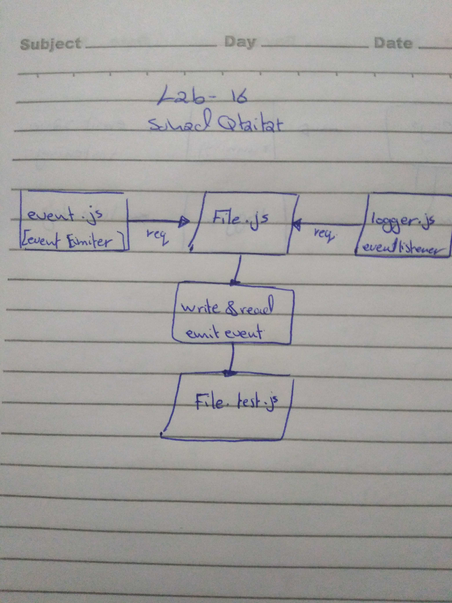

# lab-16-Event-Driven-Applications

### Authors: sohad Qtaitat

### Links and Resources
* [submission PR](https://github.com/401-advanced-javascript-sohad/lab-16-Event-Driven-Applications/pull/1) 

* [action](https://github.com/401-advanced-javascript-sohad/lab-16-Event-Driven-Applications/runs/435097328?check_suite_focus=true)

### Create an application that can modify a file, using events for status notifications

### Modules
#### events.js
#### logger.js

#### Running the app
* `node app.js test.txt`
  
#### Tests
* npm testing will do the following:
  * Inside the terminal, run the "Running the app" command
  * Expect the result of running the command to be truthy if successful
  * test.txt file content will be saved

### UML

